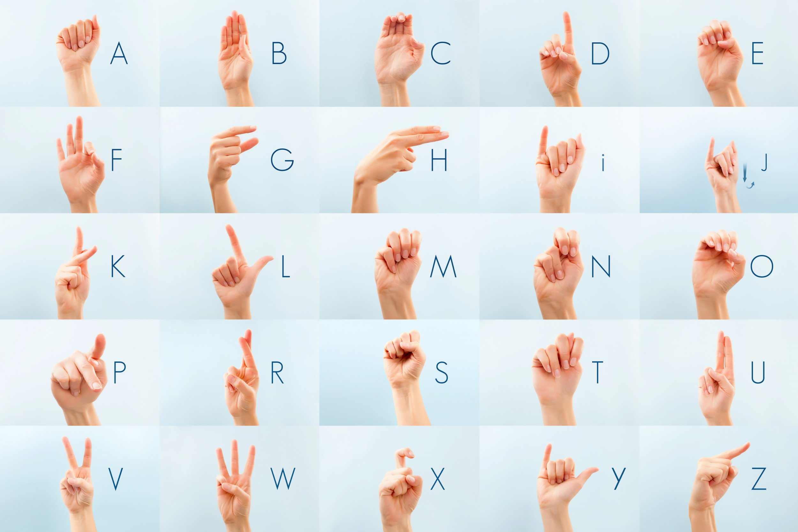

# ASL Classification with Deep Learning
## Description
Main objective of this program is to classify American Sign Language (ASL) alphabets with deep learning methods. Background of why I choose ASL Classification is because I interested in Sign Language even though not yet understand that. It is also hoped that the development of this program will bring together more deaf & mute people with normal people. It is possible that maybe the next step of this topic will be able to develop a Sign Language Detector and be able to translate the Sign Language into sentences and be able to arrange them grammatically. And that will be needed an extra effort to realize the program because it will require Computer Vision and also Natural Language Processing. But before I go any deeper, I intend to start with the ASL Alphabeth Classifier.

My main method to make this is using a deep learning approach. I use Convolution Neural Nets to create the classifier and apply transfer learning with pre-trained models. I used Resnet50 as the backbone fine-tune it with my own dataset (which I got from [this](https://www.kaggle.com/grassknoted/asl-alphabet) link). For the architecture, I used Pytorch as the base framework and used Nodeflux's Vortex which is based on Pytorch Lightning to help me build the model and do the inference.

## Installation Guide
