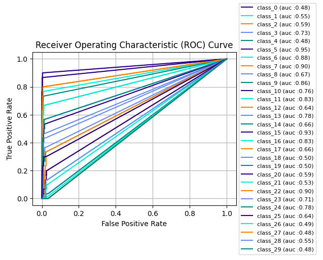

# ASL Classification with Deep Learning
## Description
Main objective of this program is to classify American Sign Language (ASL) alphabets with deep learning methods. Background of why I choose ASL Classification is because I interested in Sign Language even though not yet understand that. It is also hoped that the development of this program will bring together more deaf & mute people with normal people. It is possible that maybe the next step of this topic will be able to develop a Sign Language Detector and be able to translate the Sign Language into sentences and be able to arrange them grammatically. And that will be needed an extra effort to realize the program because it will require Computer Vision and also Natural Language Processing. But before I go any deeper, I intend to start with the ASL Alphabeth Classifier.

My main method to make this is using a deep learning approach. I use Convolution Neural Nets to create the classifier and apply transfer learning with pre-trained models. I used Resnet50 as the backbone fine-tune it with my own dataset (which I got from this [Kaggle](https://www.kaggle.com/grassknoted/asl-alphabet) link). For the architecture, I used Pytorch as the base framework and used Nodeflux's Vortex which is based on Pytorch Lightning to help me build the model and do the inference.


## Installation Guide
For installation options, currently I don't provide the docker image yet. But you can run this simply by clone or fork this repository. I already put my training notebooks in [Training Notebooks](https://github.com/zogojogo/ASL-Classification/tree/main/Training%20Notebooks) folder. U could try it to inspect how I created the model. But if you only want to try the model with real images, here are few steps to perform it.

* Clone this repository in your local with this command ```git clone https://github.com/zogojogo/ASL-Classification.git```
* Install the requirement modules ```pip install -r requirements.txt```
* If the module already satisfied, choose one of two python script provided to perform the inference. The difference is [inference.py](https://github.com/zogojogo/ASL-Classification/blob/main/inference.py) is the Pytorch only version, while [inference2.py](https://github.com/zogojogo/ASL-Classification/blob/main/inference2.py) is Pytorch + Vortex version.

### Inference.py
To use ```inference.py```, the model is in ```.pt``` format. My ```.pt``` saved model is in [this](https://github.com/zogojogo/ASL-Classification/tree/main/.pt%20Models) folder. I've also provided some sample images for you to try that stored in [here](https://github.com/zogojogo/ASL-Classification/tree/main/Test%20Data) so you can use it to try the program. So here's the command to perform the inference which u can write in your venv terminal.

1. See details arguments
```python inference.py -h```

2. Perform inference
```python inference.py -p <your_image_path>```

### Inference2.py
To use ```inference2.py```, the model is use ```.onnx``` format. Here's how to perform the inference.

1. See details arguments
```python inference2.py -h```

2. Perform inference
```python inference2.py -m <onnx_model> -p <your_image_path>```

## Model Performance
### Training
This is how the model performs in the training


### Testing
This is how the model performs in their own test data.


### Benchmark
This is when the problem come. My model is not quite good when it comes to another data source. (even from my own picture in [this](https://github.com/zogojogo/ASL-Classification/tree/main/Self%20Test) folder), I also try from this [kaggle](https://www.kaggle.com/danrasband/asl-alphabet-test) data to test my model. And here's how the model performs in the danrasband's ASL data test.



